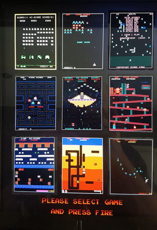

 ---
layout: home
title: "retro-console - A tribute to the Golden Age of video games"
image: assets/favimage-840x472.jpg
----------------------------------

  
\[The console in use at the 2016 edition of Revision demoscene party [https://2016.revision-party.net/](https://2016.revision-party.net/)\]

# retro-console

A tribute to the Golden Age of video games

### Welcome to the Wonderful World of browser DPI.

This is a placeholder project containing some introductory images.

The project consists of:

 - Creating and assembling the console, including a stereo sound system and Raspberry-Pi
 - Patching and getting the mame emulator to run on the Raspberry-Pi
 - Designing an animated splash screen and launcher

Still to do, uploading all the Mame adaptations and the source for the animated splash screen and selector.

## Golden age

[https://en.wikipedia.org/wiki/Golden_age_of_arcade_video_games](https://en.wikipedia.org/wiki/Golden_age_of_arcade_video_games)

The following titles have been included:

 - Space invaders (1978), where it all started
 - Galaxian (1979), the first game with colours
 - Centipede (1981),using a trackball as controller (Misile command (1980) was the first)
 - Pac-man (1980), the most successful coin-operated game
 - Phoenix (1980), first game with an end-boss
 - Donkey Kong (1981), the birth of Mario
 - Frogger (1981), patience is a virtue
 - Dig Dug (1082), underground
 - Gyruss (1983), first game with stereo sound

Gyruss is my personal favourite, and I installed a stereo sound system specially for it.

## Photo shoot

Front with splash screen

Closeup of the splash screen.

Back side and artwork

The Raspberr-Pi and sound system

Closeup of the switches. The joystick was extra heavy dudy quality, which turned out to be a very wise choice seeing how some games made people highly enthusiastic.

## Versioning

This project adheres to [Semantic Versioning](http://semver.org/spec/v2.0.0.html).
For the versions available, see the [tags on this repository](https://github.com/xyzzy/retro-console/tags).

## License

This project is licensed under Affero GPLv3 - see the [LICENSE.txt](LICENSE.txt) file for details.
